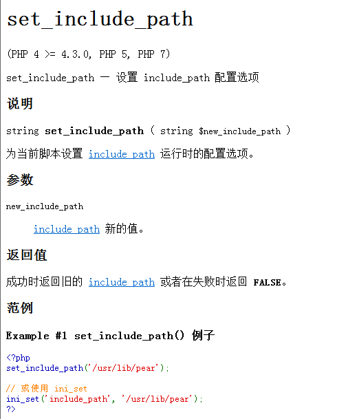
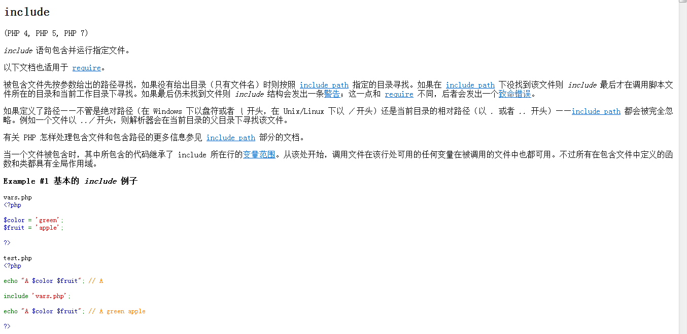

### 递归函数

*定义*

* 当前函数在当前函数体内调用它自己，这种函数称为递归函数

*作用*

* 分解问题，调用自己

```PHP
function sive($i){ // 3
    $sum = 1;
    echo "sive().$i的值为{$i}.\n";
    if($i ==1){
        echo "\$i = {$i}; \$sum = {$sum}\n";
        return 1;
    }else{
        $sum = $i*sive($i-1);
    }
    echo "\$i = {$i}; \$sum = {$sum}\n";
    return $sum;
}
sive(3);
```
* 自己调用自己，无限分类就需要用掉递归

> set_include_path  设置 include_path 配置选项



> include 语句引入并运行指定文件。


