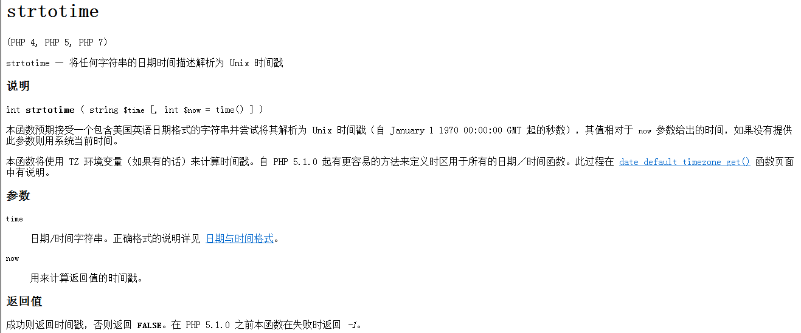
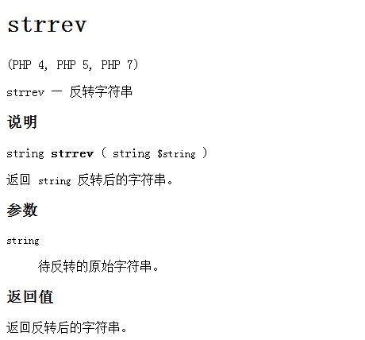
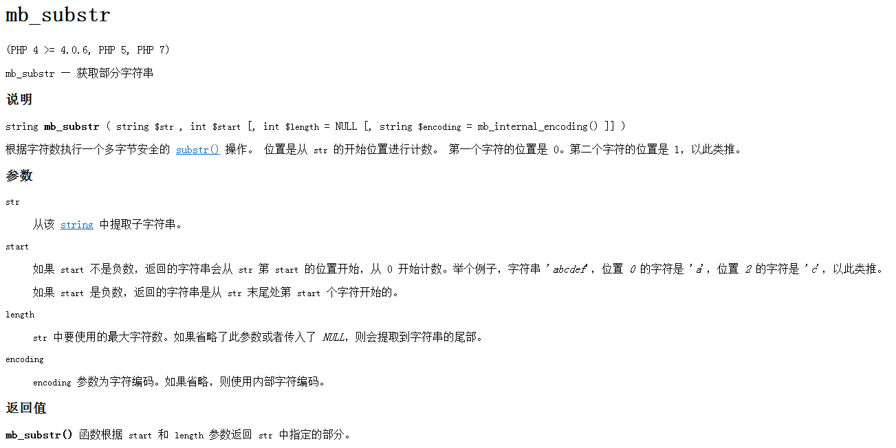
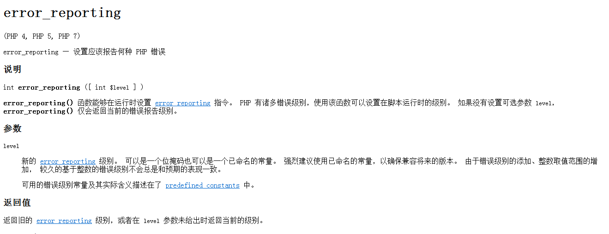
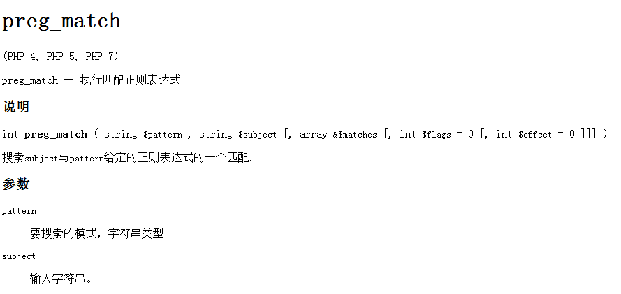

### 1、用PHP打印出前一天的时间格式是2006-5-10 22:21:21

```PHP
date_default_timezone_set('Asia/Shanghai'); //设置地区
echo $date = time() . '<br>'; //非正常时间戳，当前时间
echo date('Y-m-d H:i:s', Time() - 24 * 3600); //正常时间戳 ，前一天的时间
echo date('Y-m-d H:i:s', strtotime('-1 day'));//正常时间戳 ，前一天的时间

// strtotime — 将任何字符串的日期时间描述解析为 Unix 时间戳
```


### 2、echo(),print(),print_r()的区别

* echo是PHP语句, print和print_r是函数,语句没有返回值,函数可以有返回值(即便没有用)
* print只能打印出简单类型变量的值(如int,string)
* print_r和var_dump可以打印出复杂类型变量的值(如数组,对象)
* echo -- 输出一个或者多个字符串也可以输出整型或者布尔

### 3、如何实现字符串翻转？
```PHP
echo strrev('abcd'); //dcba
```



### 4、优化MYSQL数据库的方法。
* (1).选取最适用的字段属性,应该尽量把字段设置为NOT NULL，这样在将来执行查询的时候，数据库不用去比较NULL值。
* (2).使用连接（JOIN）来代替子查询(Sub-Queries)
* (3).使用联合(UNION)来代替手动创建的临时表
* (4).尽量少使用 LIKE 关键字和通配符
* (5).使用事务和外键

### 5、PHP的意思
Hypertext Preprocessor
超级文本预处理语言

### 6、MYSQL取得当前时间的函数是?，格式化日期的函数是

now(), DATE_FORMAT(date,format),date()

### 7、实现中文字串截取无乱码的方法。(3分)
mb_substr()


### 8、您是否用过版本控制软件? 如果有您用的版本控制软件的名字是?

用过，git

### 9、您是否用过模板引擎? 如果有您用的模板引擎的名字是?

smarty

### 10、语句include和require的区别是什么?为避免多次包含同一文件，可用(?)语句代替它们?

require()和include()除了怎样处理失败之外在各方面都完全一样。include()产生一个警告而require()则导致一个致命错误。
换句话说，如果你想在丢失文件时停止处理页面,用require()。include() 就不是这样，脚本会继续运行。
require()无论如何都会包含文件,而include()可以有选择地包含.

代替用

>include_once

>require_once

### 11、如何修改SESSION的生存时间

```PHP
$savePath = "./session_save_dir/";
$lifeTime = 24 * 3600;
session_save_path($savePath);
session_set_cookie_params($lifeTime);
session_start();
```
>session_save_path() ---读取/设置当前会话的保存路径
>session_set_cookie_params() ---设置会话 cookie 参数
>session_start ---开启session会话

### 12、如何得到一个网页的内容?
```PHP
$url = "http://www.jb51.net/article/24978.htm";
file_get_contents($url);
```
### 13、在PHP中，heredoc是一种特殊的字符串，它的结束标志必须?
跟起始的一样，且结束标志前也要一个换行，后面加上分号

### 14、写出发贴数最多的十个人名字的SQL，利用下表：members(id,username,posts,pass,email)
```PHP
$sql = "select name form members order By posts DESC limit 10";
```
### 15、请说明php中传值与传引用的区别。什么时候传值什么时候传引用？

按值传递：函数范围内对值的任何改变在函数外部都会被忽略

按引用传递：函数范围内对值的任何改变在函数外部也能反映出这些修改

优缺点：

按值传递时，php必须复制值。特别是对于大型的字符串和对象来说，这将会是一个代价很大的操作。

按引用传递则不需要复制值，对于性能提高很有好处。

### 16、在PHP中error_reporting这个函数有什么作用？

>error_reporting — 设置应该报告何种 PHP 错误



### 17、请写一个函数验证电子邮件的格式是否正确

//如果电子邮件地址有效，返回true，否则返回false
```PHP
//第一种
function validateEmail($email)
{
    if (@eregi('^[_a-z0-9-]+(.[_a-z0-9-]+)*@[a-z0-9-]+(.[a-z0-9-]+)*$', $email)) {
        return true;
    } else {
        return false;
    }
}

//第二种
function checkEmail($email)
{
    $pregEmail = "/([a-z0-9]*[-_\.]?[a-z0-9]+)*@([a-z0-9]*[-_]?[a-z0-9]+)+[\.][a-z]{2,3}([\.][a-z]{2})?/i";
    return preg_match($pregEmail, $email);
}

```
> preg_match  — 执行匹配正则表达式


### 18、如何修改SESSION的生存时间

>setcookie() 或 session_set_cookie_params($lifeTime)

### 19、JS表单弹出对话框函数是?获得输入焦点函数是?
> alert() confirm() prompt() ---弹出对话框函数

> focus() ----获取输入焦点函数

### 20、JS的跳转函数是?怎么引入一个外部JS文件?
> window.location.href ---跳转函数

><scrīpt src=""/> ---引入一个外部js文件


### 21、foo()和@foo()之间有什么区别？

在PHP中 @是可以忽略掉警告的错误

注意: @ 运算符只对表达式有效。对新手来说一个简单的规则就是：如果能从某处得到值，就能在它前面加上 @ 运算符。

### 22、mysql_fetch_row() 和mysql_fetch_array之间有什么区别？

mysql_fetch_row -- 从结果集中取得一行作为枚举数组 [参考](http://www.w3school.com.cn/php/func_mysql_fetch_row.asp)

mysql_fetch_array -- 从结果集中取得一行作为关联数组，或数字数组，或二者兼有
[参考](http://www.w3school.com.cn/php/func_mysql_fetch_array.asp)

### 23、GD库是做什么用的？

GD库提供了一系列用来处理图片的API，使用GD库可以处理图片，或者生成图片。
在网站上GD库通常用来生成缩略图或者用来对图片加水印或者对网站数据生成报表。

### 24、请写出数据类型(int char varchar datetime text)的意思; 请问varchar和char有什么区别

int 数值类型 char 固定长度字符串 varchar 可变长字符串 datetime 日期时间型 text 字符字符串

char列的长度固定为创建表时声明的长度.varchar列中的值为可变长字符串


### 25、检测一个变量是否有设置的函数?这个函数是否为空的函数?
> isset()  — 检测变量是否设置

> empty()— 检查一个变量是否为空

### 26、取得查询结果集总数的函数是?

> count() — 计算数组中的单元数目，或对象中的属性个数

### 27、$a = 'abcdef'; 请取出$a的值并打印出第一个字母

echo $a{0};

### 28、请写出PHP5权限控制修饰符
> private --私有的

>protected --保密的

>public --公共的

### 29、请写出php5的构造函数和析构函数

> __construct ---构造函数

> __destruct ---析构函数
