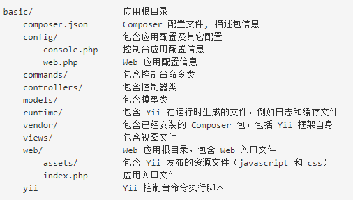
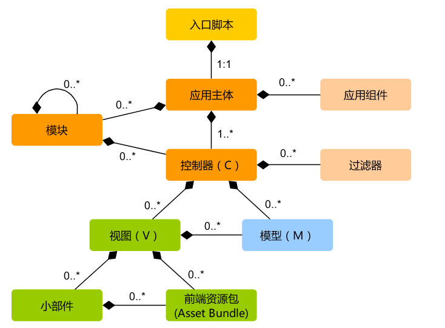
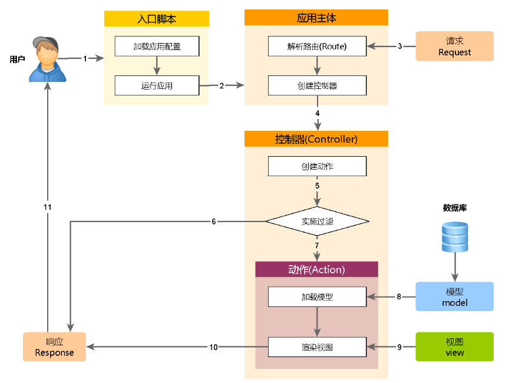

### 应用结构

* Yii 实现了模型-视图-控制器 (MVC)设计模式，这点在上述目录结构中也得以体现。
* models 目录包含了所有模型类，views 目录包含了所有视图脚本，controllers 目录包含了所有控制器类。

#### 应用的静态结构

* 每个应用都有一个入口脚本 web/index.php，这是整个应用中唯一可以访问的 PHP 脚本。
* 入口脚本接受一个 Web 请求并创建应用实例去处理它。
* 应用在它的组建辅助下解析请求，并分派请求至 MVC 元素。
* 视图使用小部件去创建复杂和动态的用户界面。

#### 应用如何处理请求

* 用户向入口脚本 web/index.php 发起请求。
* 入口脚本加载应用配置并创建一个应用实例去处理请求。
* 应用通过请求组件解析请求的路由。
* 应用创建一个控制器实例去处理请求。
* 控制器创建一个操作实例并针对操作执行过滤器。
* 如果任何一个过滤器返回失败，则操作退出。
* 如果所有过滤器都通过，操作将被执行。
* 操作会加载一个数据模型，或许是来自数据库。
* 操作会渲染一个视图，把数据模型提供给它。
* 渲染结果返回给响应组件。
* 响应组件发送渲染结果给用户浏览器。
