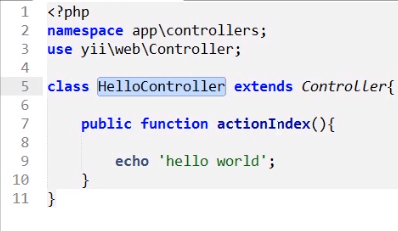
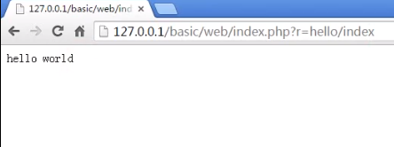
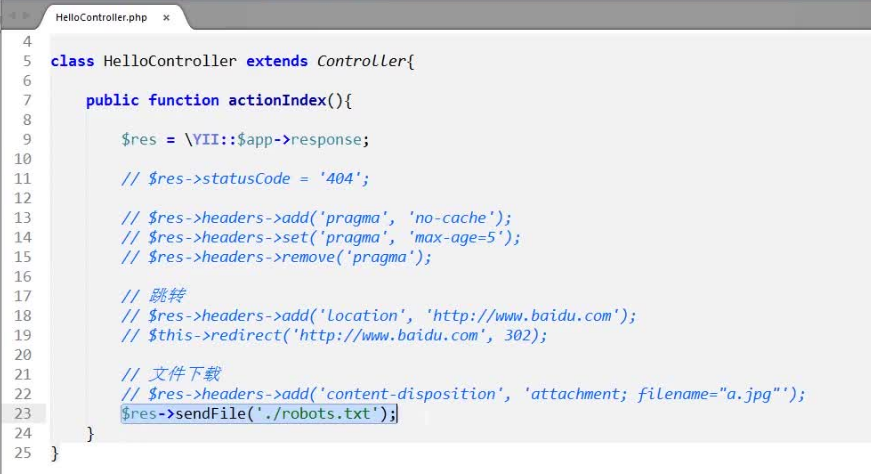
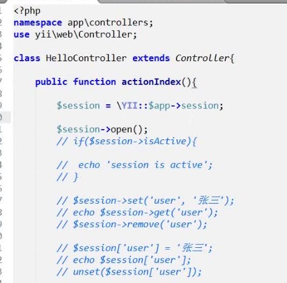

### 创建控制器



```PHP
namespace app\controllers;  //生成命名空间
use yii\web\Controllers;    //引入Controller
extends                     //继承Controller
actionIndex                 //在yii下每个控制器方法都要加action前缀
```
### 访问控制器/方法


* r = 控制器名/方法名
* basic 根目录
* web/index.PHP 入口文件

### 请求数据

* get
* post
```PHP
\Yii::$app->request->get('id'); //获取get 过来的id
\Yii::$app->request->post('id'); //获取post 过来的id
\Yii::$app->request->isPost // 判断是否是post请求
\Yii::$app->request->isGet  //判断是否是get请求
```
* Yii 是一个全局的类
* $app 是一个应用主体
* request 是$app下的请求主键
* get 和 post 都是一种方式获取对应的提交数据
* ('id') 请求获取id的值

[更多请求](http://www.yii-china.com/doc/guide/runtime_request.html)

### 响应


* Yii 是一个全局的类
* $app 是一个应用主体
* response 是$app下的请求主键
* statusCode//设置服务器状态码
* headers->add / set / remove 添加 / 修改 / 删除头文件中的某个属性
* $res->headers->add('...')原生方法跳转
* $this->redirect('<网址>',（<设置服务器返回的状态码>）)yii封装的方法跳转
* $res->headers->add('...') 原生的文件下载
* $res->sendFile('web目录下的文件'); yii封装的下载

### session



* Yii 是一个全局的类
* $app 是一个应用主体
* session 是$app下的请求主键
* $session->isActive; 判断session是否开启
* $session->open(); 开启session


* $session->set('user','张三'); 将session当成对象的形式去写入session
* echo $session->get('user'); 调用session里存的 user
* $session->remove('user'); 删除session里的 user 值


* $session['user'] = '张三'; 将session当成数组形式写入session
* echo $session['user'] 直接去调用
* unset($session['user']) 删除session里的user 值

[更详细的session](http://www.yii-china.com/doc/guide/runtime_sessions_cookies.html)

* 经过ArrayAccess接口实现的对象 都可以作为对象和数组来使用

[参考 ArrayAccess](http://php.net/manual/en/class.arrayaccess.php)

#### session识别原理：
**当session生成的时候 浏览器会生成一个sessionID 然后会根据sessionID作为文件名称存入服务器的session存放目录 等到不同的浏览器去取的时候会去取出对应的session文件中的数据，因为sessionID是由浏览器生成的所以不同的浏览器之间不能相互拿值**
