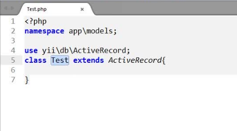
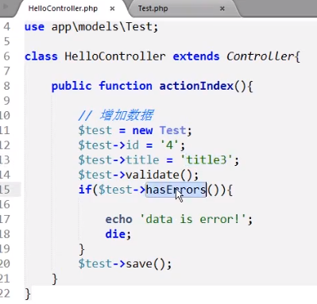
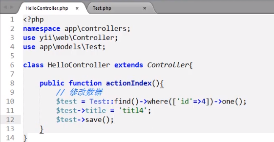

### 数据表配置

* 数据表配置文件是在config下的db.php

### 创建model文件

* model是在models文件下建立的
* model层的文件名要和表名一致
* model层类需要继承ActiveRecord
* 当然 ActiveRecord 也需要引入一下， yii\db\ActiveRcord 引入ActiveRcord



### 查询数据

* 原生sql 查询语句在yii里的使用

```PHP
$id = 1;
$sql = 'select * form test where id = :id';
$res = Test::findBySql($sql,[':id'=>$id])
```

* yii 里独特的sql查询语句

```PHP
id = 1; //查询id等于1的数据
$res = Test::find()->where('id = :id',[':id'=>1])->all()
or
$res = Test::find()->where(['id'=>1])->all()

id >0 ;//查询id小于0的数据
$res =  Test::find()->where(['>','id',0])->all()

id >= 1 并且 id <= 2 // between(注：两者之间的) 查询id大于或等于1并且小于或等于2的数据
$res = Test::find()->where(['between','id',1,2])->all()

//asArray() 将查询到的结果转化为数组
$res = Test::find()->where(['between','id',1,2])->asArray()->all()

//批量查询 每次查询5条数据 赋给$res
foreach (Test::find()->batch(5) as $res) {

}
```
[更多sql条件参考](http://www.yiichina.com/doc/api/2.0/yii-db-query#where()-detail)

### 删除数据

```PHP
//删除id等于1的数据
Test::deleteAll('id = :id',[':id'=>1]);
```
### 添加数据



* $test->validate(); 验证数据
* if($test->..) 判断验证是否有错误
* $this->save() 添加到数据库

### 更新数据

* 更新id为4的数据，先查询到id为4的数据然后再去覆盖它


