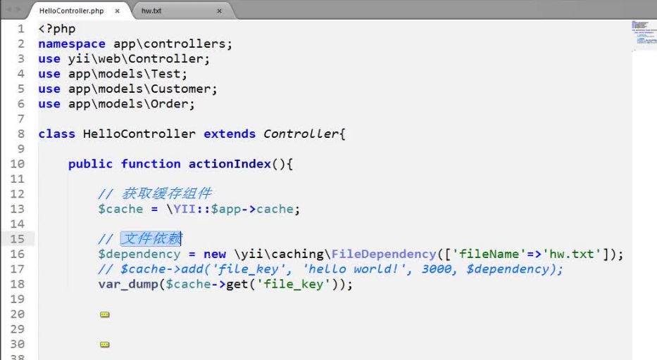
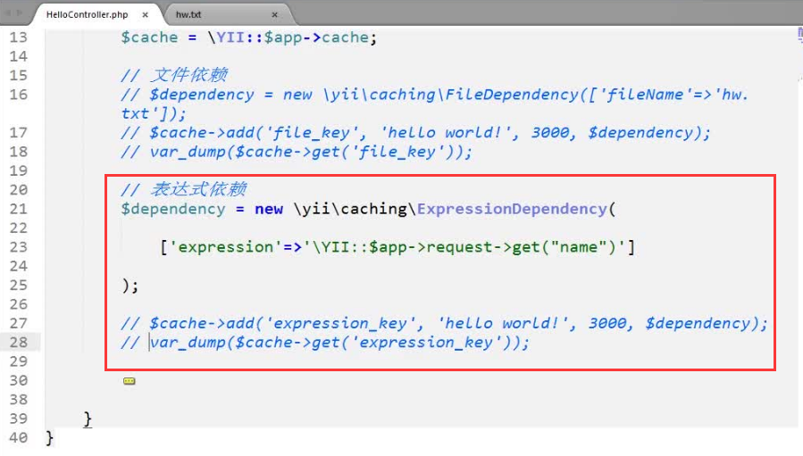

### 缓存

[详细参考](http://www.yii-china.com/doc/guide/caching_data.html)

#####设置缓存的有效期

* add('key','value',有效期);
* set('key','value',有效期);

### 缓存依赖

* 文件依赖,其中那个被依赖的文件发生改变的话,相关联的缓存就会失效



* 表达式依赖，和文件依赖一样，依赖的表达式里的值发生改变，相关的缓存就会直接消失



* DB依赖，跟其他缓存依赖一样,如果依赖中的sql取出的数据发生了改变,相关的缓存就会消失


### 片段缓存

* 片段缓存适合来缓存数据量较大，而不会经常变动的数据，从而会大大提升网站访问展示的速度

* 片段缓存介绍(主要负责把前端界面的一些区域[不会经常变动的区域：如京东商品分类]缓存起来[缓存到内存或文件中]，下次访问时直接从缓存里把数据拿出来，而不用再从数据库抓取信息，提高了程序的执行效率)

```PHP
<?php if($this->beginCache('cache_div')){?> //yii 里的缓存小组件 ，开头
<div id="cache_div">
    <div>这里待会会被缓存</div>
</div>
<?php
    $this->endCache(); //结束
}
?>
<div id="no_cache_div">
    <div>这里不会被缓存</div>
</div>
```
