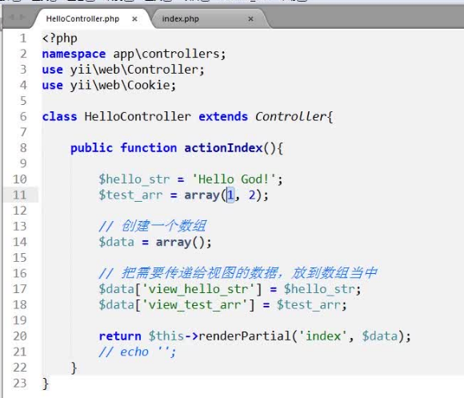

### 视图的创建

* 视图文件一定要放在view文件夹下控制器同名的文件夹中

* renderPartial('index') 渲染index页面
* render()和renderPartial()区别：
* renderPartial不加载任何layouts，而render刚好相反。
### 数据传递

* 在视图层使用 controller传递过来的数据方法： 直接使用数组中的 键值 获取 数据值

### 布局文件

* Yii里的布局文件在web/layouts目录下建立

* public $layout = 'common'; 引入布局文件
* $this->reder('index'); 将index里显示的视图放到 $content 中
* 公共布局文件中一定要输出一下这个变量 $content 否则无法正常显示

### 视图中显示另一个视图

* 感觉这个并没有什么用
* 只需要在一个视图文件中 写 <?php $this->render('需要显示的视图文件');?>即可
