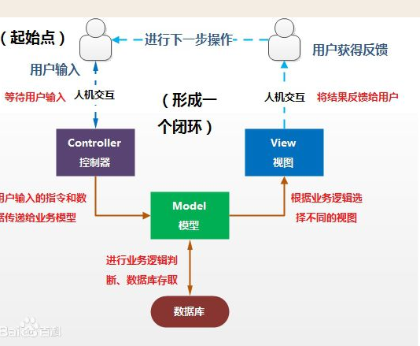

### 什么是mvc

设计模式（Design pattern）是一套被反复使用、多数人知晓的、经过分类编目的、代码设计经验的总结。使用设计模式是为了可重用代码、让代码更容易被他人理解、保证代码可靠性。 毫无疑问，设计模式于己于他人于系统都是多赢的；设计模式使代码编制真正工程化；设计模式是软件工程的基石脉络，如同大厦的结构一样。
　　那么，从我个人的角度理解，就相当于盖一栋楼和盖一座房子。
　　　　盖一栋楼和盖一座房子，他们动工的流程基本都是一样的：设计师出图纸、打地基、用砖垒、封楼顶。
　　　　但是他们不一样的地方在于 盖一栋楼所出的图纸、所要打的地基的深度等等和盖一座房子所用的图纸、所要打的地基的深度都是不一样的。因此，他们动工的这些流程就可以看作是设计模式的一种，而他们实际盖的时候所需要的架构就类似于MVC框架模式

[参考](http://www.cnblogs.com/xiyoulc/p/5453127.html)

