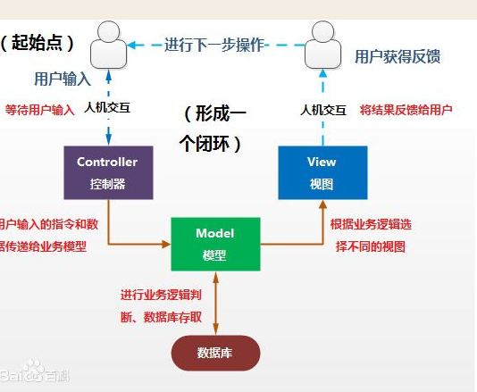

### 什么是mvc？

答：设计模式（Design pattern）是一套被反复使用、多数人知晓的、经过分类编目的、代码设计经验的总结。使用设计模式是为了可重用代码、让代码更容易被他人理解、保证代码可靠性。 毫无疑问，设计模式于己于他人于系统都是多赢的；设计模式使代码编制真正工程化；设计模式是软件工程的基石脉络，如同大厦的结构一样。
　　那么，从我个人的角度理解，就相当于盖一栋楼和盖一座房子。
　　　　盖一栋楼和盖一座房子，他们动工的流程基本都是一样的：设计师出图纸、打地基、用砖垒、封楼顶。
　　　　但是他们不一样的地方在于 盖一栋楼所出的图纸、所要打的地基的深度等等和盖一座房子所用的图纸、所要打的地基的深度都是不一样的。因此，他们动工的这些流程就可以看作是设计模式的一种，而他们实际盖的时候所需要的架构就类似于MVC框架模式

[参考](http://www.cnblogs.com/xiyoulc/p/5453127.html)

### 为什么要使用mvc模式？

1.一方面使其数据和其表示分离，使得添加或者删除一个用户变得容易，甚至可以在程序运行时动态的执行，model 和view
能够单独的开发，增加了程序的，可维护性，可扩展性并使测试变得容易，另一方面，控制逻辑和表现层分离，运行程序能够在运行时根据工作流，用户习惯
或者模型状态，来动态选择不同的用户界面，因此MVC 模式广泛应用于web  GUI 程序的架构

> 分成清晰，便于扩展

### 在yii里为什么不使用原生的html form表单，而使用yii提供的form组件？

因为使用原生的html需要修改一些yii内部的配置 [详细参考](http://blog.csdn.net/arthuralston2015/article/details/44284609)
使用yii提供的form组件里的功能多

### php的优缺点
PHP优点：
1. 一种能快速学习、跨平台、有良好数据库交互能力的开发语言。
2. 简单轻便，易学易用。
3. 与Apache及其它扩展库结合紧密。
4. 良好的安全性。

缺点：
1. 数据库支持的极大变化。
2. 不适合应用于大型电子商务站点
3. 安装复杂。
4. 缺少正规的商业支持。
5. 无法实现商品化应用的开发。

###php中的@作用

@是可以屏蔽函数执行过程中遇到问题而产生的一些错误、警告信息，这样用户就看不到程序的出错信息。这样除了用户界面会友好一些外，更重要的是安全性，因为屏蔽了出错文件的路径等信息
