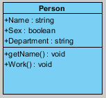
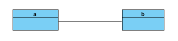
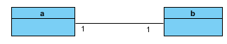
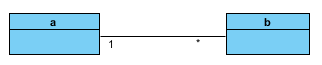
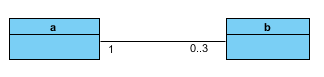
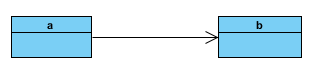
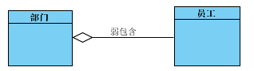
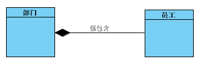
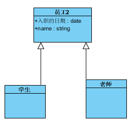
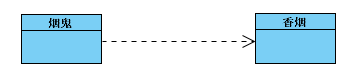

### 什么是类图

[类图工具下载](https://www.visual-paradigm.com/download/community.jsp)

* 一个简单的类图

* ‘+’ 等于 public 公共的
* ‘-’ 等于 private 私有的
* ‘#’ 等于 protected 保密的

## 类图基本语法和关系

### 关联 关系

####直线关系

* 这个直线关系就是关联
  - 如果觉得两个业务概念之前有联系，暂时不能确定具体是怎样的，那么就先画一条线将两者连起来。
  - 随着对业务的理解，这条线会进一步具体化，可以为这条线添加更多元素

#### 一对一关系

* a、b两个类用一条直线相连，但是在直线两端有一个数字‘ 1 ’，表示一个 a 对一个 b

#### 一对多的关系

* 表示一个 a 对应多个 b

#### 一对零到三个关系

* 表示一个 a 对应 0到3个b

#### 导航关系

### 包含关系

* 弱包含（聚合）

* 弱包含就是，一个部门可以有多个员工，这个部门散了员工依然存在

* 强包含（组合）

* 强包含就是，一个部门只能有一个员工，这个部门散了员工就不存在了

### 继承关系
* 继承也叫做泛化

* 学生和老师都继承了员工的属性，同时也可以拥有自己的属性

### 依赖 关系

* 烟鬼依赖烟，然后要是没有烟，烟鬼就不能生活
