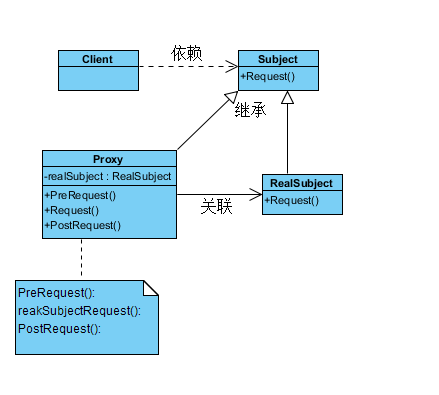

### 代理模式的概述

在软件开发中，也有一种设计模式可以提供与代购网站类似的功能。由于某些原因，客户端不想或不能直接访问一个对象，此时可以通过一个称之为“代理”的第三者来实现间接访问，该方案对应的设计模式被称为代理模式

给某一个对象提供一个代理或占位符，并由代理对象来控制对原对象的访问

##### (1) Subject（抽象主题角色）
它声明了真实主题和代理主题的共同接口，这样一来在任何使用真实主题的地方都可以使用代理主题，客户端通常需要针对抽象主题角色进行编程

##### (2) Proxy（代理主题角色）
它包含了对真实主题的引用，从而可以在任何时候操作真实主题对象；在代理主题角色中提供一个与真实主题角色相同的接口，以便在任何时候都可以替代真实主题；代理主题角色还可以控制对真实主题的使用，负责在需要的时候创建和删除真实主题对象，并对真实主题对象的使用加以约束。通常，在代理主题角色中，客户端在调用所引用的真实主题操作之前或之后还需要执行其他操作，而不仅仅是单纯调用真实主题对象中的操作

#####  (3) RealSubject（真实主题角色）
它定义了代理角色所代表的真实对象，在真实主题角色中实现了真实的业务操作，客户端可以通过代理主题角色间接调用真实主题角色中定义的操作

[详细参考](http://blog.csdn.net/lovelion/article/details/8227953)
