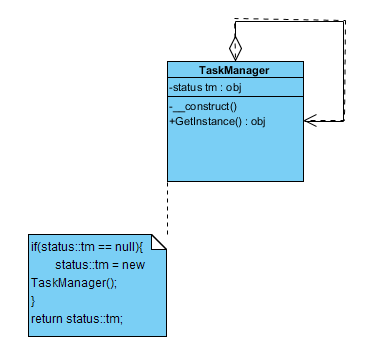

### 使用单例模式的动机是什么？

答：为了节约系统资源，有时需要确保系统中某个类只有唯一一个实例，当这个唯一实例创建成功之后，我们无法再创建一个同类型的其他对象，所有的操作都只能基于这个唯一实例。为了确保对象的唯一性

### 单例模式的概述

确保某一个类只有一个实例，而且自行实例化并向整个系统提供这个实例，这个类称为单例类，它提供全局访问的方法。单例模式是一种对象创建型模式。

* 代码概述

```PHP
final class TaskManager
{
    private static $tm = null;

    private function __construct()
    {

    }

    public static function getInstance()
    {
        if (static::$tm == null) {
            static::$tm = new TaskManager();
        }
        return static::$tm;
    }
}
```
> final 让这个类不能被继承、让方法不能被修改 static 设置静态方法或属性的关键字
* 概述类图


### 饿汉式单例与懒汉式单例

* 1.饿汉式单例

饿汉式单例类是实现起来最简单的单例类


```PHP
class Aaa
{
    private static final $tm = new Aaa();

    private function __construct()
    {
    }

    public static function getInstance()
    {
        return static::$tm;
    }
}
```

当类被加载时，静态变量$tm会被初始化，此时类的私有构造函数会被调用，单例类的唯一实例将被创建。如果使用饿汉式单例来实现负载均衡器LoadBalancer类的设计，则不会出现创建多个单例对象的情况，可确保单例对象的唯一性。

* 2.懒汉式单例类与线程锁定

 除了饿汉式单例，还有一种经典的懒汉式单例

```PHP
class Bbb
{
    private static $instance = null;

    private function __construct()
    {
    }

    public static function getInstance()
    {
        if (static::$instance == null) {
            static::$instance = new Bbb();
        }
        return static::$instance;
    }
}
```


懒汉式单例在第一次调用getInstance()方法时实例化，在类加载时并不自行实例化，这种技术又称为延迟加载(Lazy Load)技术，即需要的时候再加载实例，为了避免多个线程同时调用getInstance()方法

[饿汉式单例与懒汉式单例详细参考](http://blog.csdn.net/lovelion/article/details/7420886)  

### 单例模式总结

答：单例模式作为一种目标明确、结构简单、理解容易的设计模式，在软件开发中使用频率相当高，在很多应用软件和框架中都得以广泛应用

[详细参考](http://blog.csdn.net/lovelion/article/details/7420889)
