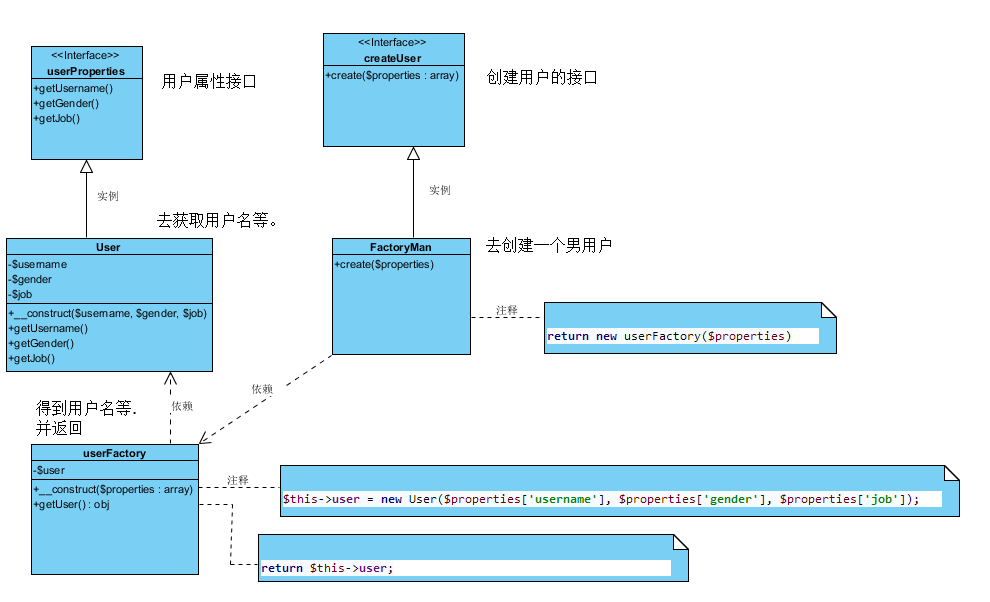

### 工厂方法模式概述

定义一个用于创建对象的接口，让子类决定将哪一个类实例化。工厂方法模式让一个类的实例化延迟到其子类。工厂方法模式又简称为工厂模式(Factory Pattern)，又可称作虚拟构造器模式(Virtual Constructor Pattern)或多态工厂模式(Polymorphic Factory Pattern)。工厂方法模式是一种类创建型模式。



[概述参考](http://blog.csdn.net/lovelion/article/details/9306745)

```PHP
/**
 * 工厂方法模式
 **/
interface userProperties //用户属性接口
{
    public function getUsername(); //用户名

    public function getGender(); //性别

    public function getJob(); //工作
}

interface createUser // 创建用户的接口
{
    public function create($properties); //创建用户
}

class User implements userProperties //实现用户属性接口
{
    private $username; //设置一个私有的用户名
    private $gender;//设置一个私有的性别
    private $job;//设置一个私有的职业

    public function __construct($username, $gender, $job) //构造函数，参数为用户名...
    {
        $this->username = $username; //给用户名赋值
        $this->gender = $gender;
        $this->job = $job;
    }

    public function getUsername() //获取用户名
    {
        return $this->username; //还回用户名
    }

    public function getGender()
    {
        return $this->gender;
    }

    public function getJob()
    {
        return $this->job;
    }
}

class userFactory //这是一个用户工厂
{
    private $user; //设置一个用户

    public function __construct($properties = []) //构造函数 参数为数组
    {
        $this->user = new User($properties['username'], $properties['gender'], $properties['job']); //实例user这个类
    }

    public function getUser() //获取这个用户
    {
        return $this->user; //返回这个用户
    }
}

class FactoryMan implements createUser //继承创建用户这个接口，创建男性用户
{
    public function create($properties)
    {
        return new userFactory($properties);
    }
}

class clientUser //客服端
{
    public static function getClient($properties)
    {
        $fac = new FactoryMan; //实例创建男性用户的类
        $man = $fac->create($properties); //调用创建用户的方法
        echo $man->getUser()->getUsername();
    }
}

$employers = [
    ['username' => 'asdsa', 'gender' => 'male', 'job' => 'coder'],
    ['username' => 'Marry', 'gender' => 'female', 'job' => 'designer'],
];
$user = clientUser::getClient($employers[0]);
```
### 工厂方法的总结

工厂方法模式是简单工厂模式的延伸，它继承了简单工厂模式的优点，同时还弥补了简单工厂模式的不足。工厂方法模式是使用频率最高的设计模式之一，是很多开源框架和API类库的核心模式

[总结参考](http://blog.csdn.net/lovelion/article/details/9307561)
