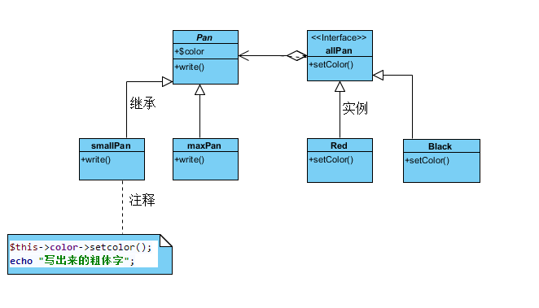

### 桥接模式

桥接模式用一种巧妙的方式处理多层继承存在的问题，用抽象关联取代了传统的多层继承，将类之间的静态继承关系转换为动态的对象组合关系，使得系统更加灵活，并易于扩展，同时有效控制了系统中类的个数

* 桥接的概念

 将抽象部分与它的实现部分分离，使它们都可以独立地变化



```PHP
<?php

/*
 * 桥接模式
 */

interface allPan
{
    public function setColor();
}


abstract class Pan
{
    public $color;

    public function setColor()
    {
    }

    public function write()
    {
    }
}

class  maxPan extends Pan
{
    public function write()
    {
        $this->color->setcolor();
        echo "写出来的粗体字";
    }
}

class smallPan extends Pan
{
    public function write()
    {
        $this->color->setcolor();
        echo "写出来的细体字";
    }
}

class Red implements allPan
{
    public function setColor()
    {
        echo "红色";
    }
}

class Blick implements allPan
{
    public function setColor()
    {
        echo "黑色";
    }
}

function testDriver() //客户端
{
    $colors = new maxPan();
    $colors->color = new Red();
    $colors->write();
}

testDriver();
```
### 桥接模式总结
桥接模式是设计Java虚拟机和实现JDBC等驱动程序的核心模式之一，应用较为广泛。在软件开发中如果一个类或一个系统有多个变化维度时，都可以尝试使用桥接模式对其进行设计。桥接模式为多维度变化的系统提供了一套完整的解决方案，并且降低了系统的复杂度

[详细参考](http://blog.csdn.net/lovelion/article/details/7464208)
