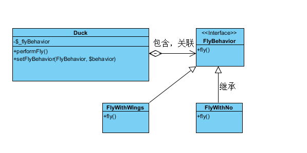

### 策略模式概述

策略模式，将一组特定的行为和算法封装成类，来适应某些特定的上下文环境，这种模式就是策略模式

[详细参考](http://www.cnblogs.com/baochuan/archive/2012/02/27/2370008.html#3667260)


```PHP
<?php
/*
 *策略模式
 */
interface FlyBehavior
{
    public function fly();
}

class FlyWithWings implements FlyBehavior
{
    public function fly()
    {
        echo "鸭子用翅膀飞行 \n";
    }
}

class FlyWithNo implements FlyBehavior
{
    public function fly()
    {
        echo "鸭子不用翅膀飞行 \n";
    }
}

class Duck
{
    private $_flyBehavior;

    public function performFly()
    {
        $this->_flyBehavior->fly();
    }

    public function setFlyBehavior(FlyBehavior $behavior) //被外部调用设置策略的
    {
        $this->_flyBehavior = $behavior;
    }
}

class RubberDuck extends Duck
{
}

// Test Case
$duck = new RubberDuck();

/*  想让鸭子用翅膀飞行 */
$duck->setFlyBehavior(new FlyWithWings());
$duck->performFly();

/*  想让鸭子不用翅膀飞行 */
$duck->setFlyBehavior(new FlyWithNo());
$duck->performFly();
```

### 策略模式总结

  策略模式用于算法的自由切换和扩展，它是应用较为广泛的设计模式之一。策略模式对应于解决某一问题的一个算法族，允许用户从该算法族中任选一个算法来解决某一问题，同时可以方便地更换算法或者增加新的算法。只要涉及到算法的封装、复用和切换都可以考虑使用策略模式

  [详细参考](http://blog.csdn.net/lovelion/article/details/7819266)
