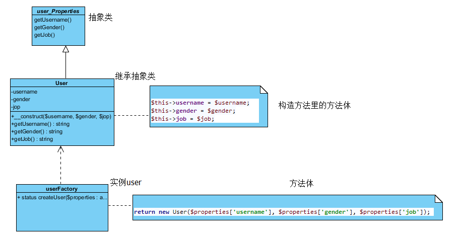
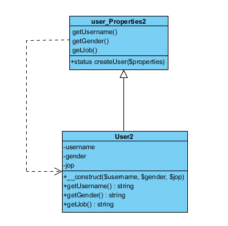

### 简单工厂模式概述

定义一个工厂类，它可以根据参数的不同返回不同类的实例，被创建的实例通常都具有共同的父类。因为在简单工厂模式中用于创建实例的方法是静态(static)方法，因此简单工厂模式又被称为静态工厂方法(Static Factory Method)模式，它属于类创建型模式。



[概述参考](http://blog.csdn.net/lovelion/article/details/9300549)
```PHP
/**
 *简单工厂模式
 * */
abstract class userProperties
{
    function getUsername()
    {
    }

    function getGender()
    {
    }

    function getJob()
    {
    }
}

class User extends userProperties
{
    private $username;
    private $gender;
    private $job;

    public function __construct($username, $gender, $job)
    {
        $this->username = $username;
        $this->gender = $gender;
        $this->job = $job;
    }

    public function getUsername()
    {
        return $this->username;
    }

    public function getGender()
    {
        return $this->gender;
    }

    public function getJob()
    {
        return $this->job;
    }
}

class userFactory
{
    public static function createUser($properties = [])
    {
        return new User($properties['username'], $properties['gender'], $properties['job']);
    }
}

$employers = [
    ['username' => 'Jack', 'gender' => 'male', 'job' => 'coder'],
    ['username' => 'Marry', 'gender' => 'female', 'job' => 'designer'],
];
$user = userFactory::createUser($employers[0]);
echo $user->getUsername();
```
### 简单工厂的简化
 代码和上面的类似，只是化简了点

#### 简单工厂模式的总结

  简单工厂模式提供了专门的工厂类用于创建对象，将对象的创建和对象的使用分离开，它作为一种最简单的工厂模式在软件开发中得到了较为广泛的应用。
[简单工厂模式的总结参考](http://blog.csdn.net/lovelion/article/details/9300731)
