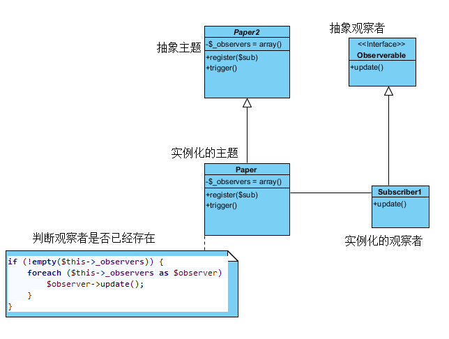

### 观察者模式概述

定义对象之间的一种一对多依赖关系，使得每当一个对象状态发生改变时，其相关依赖对象皆得到通知并被自动更新。观察者模式的别名包括发布-订阅（Publish/Subscribe）模式、模型-视图（Model/View）模式、源-监听器（Source/Listener）模式或从属者（Dependents）模式。观察者模式是一种对象行为型模式

[详细参考](http://blog.csdn.net/lovelion/article/details/7720382)

观察者模式定义对象的一对多依赖,这样一来，当一个对象改变状态时，它的所有依赖者都会收到通知并自动更新!

[详细参考](http://www.cnblogs.com/baochuan/archive/2012/02/22/2362668.html)




```PHP
<?php
/**
 * 观察者模式
 * @author: Mac
 * @date: 2012/02/22
 */

abstract class Pa
{
    private $_observers = array();

    public function register($sub)
    {
    }

    public function trigger()
    {
    }
}

class Paper extends Pa
{ /* 主题    */
    private $_observers = array(); // 存放new的对象

    public function register($sub)
    { /*  注册观察者 */
        $this->_observers[] = $sub;
    }


    public function trigger()
    {  /*  外部统一访问    */
        if (!empty($this->_observers)) {
            foreach ($this->_observers as $observer) {
                $observer->update();
            }
        }
    }
}

/**
 * 观察者要实现的接口
 */
interface Observerable
{
    public function update();
}

class Subscriber1 implements Observerable //观察者
{
    public function update()
    {
        echo "观察者1收到执行通知 执行完毕\n";
    }
}

class Subscriber2 implements Observerable //观察者2
{
    public function update()
    {
        echo "观察者2收到执行通知 执行完毕\n";
    }
}


/*  测试    */
$paper = new Paper();
$paper->register(new Subscriber1());
$paper->trigger();
```
### 观察者模式总结

 观察者模式是一种使用频率非常高的设计模式，无论是移动应用、Web应用或者桌面应用，观察者模式几乎无处不在，它为实现对象之间的联动提供了一套完整的解决方案，凡是涉及到一对一或者一对多的对象交互场景都可以使用观察者模式。观察者模式广泛应用于各种编程语言的GUI事件处理的实现，在基于事件的XML解析技术（如SAX2）以及Web事件处理中也都使用了观察者模式

[详细参考](http://blog.csdn.net/lovelion/article/details/7720537)
