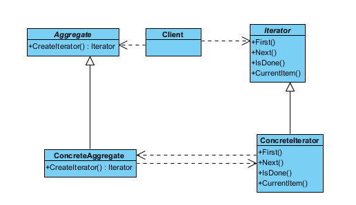
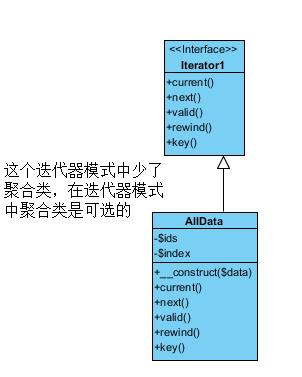

### 迭代器模式

1. 在不需要了解内部的前提下，遍历一个聚合对象的内部元素
2. 相比传统的编程模式，迭代器模式可以隐藏遍历元素的所有操作



##### Iterator（抽象迭代器）

它定义了访问和遍历元素的接口，声明了用于遍历数据元素的方法，例如：用于获取第一个元素的first()方法，用于访问下一个元素的next()方法，用于判断是否还有下一个元素的hasNext()方法，用于获取当前元素的currentItem()方法等，在具体迭代器中将实现这些方法

#####  ConcreteIterator（具体迭代器）

它实现了抽象迭代器接口，完成对聚合对象的遍历，同时在具体迭代器中通过游标来记录在聚合对象中所处的当前位置，在具体实现时，游标通常是一个表示位置的非负整数。

#####  Aggregate（抽象聚合类）

它用于存储和管理元素对象，声明一个createIterator()方法用于创建一个迭代器对象，充当抽象迭代器工厂角色。(可选)

##### ConcreteAggregate（具体聚合类）

 它实现了在抽象聚合类中声明的createIterator()方法，该方法返回一个与该具体聚合类对应的具体迭代器ConcreteIterator实例
 在迭代器模式中，提供了一个外部的迭代器来对聚合对象进行访问和遍历，迭代器定义了一个访问该聚合元素的接口，并且可以跟踪当前遍历的元素，了解哪些元素已经遍历过而哪些没有。迭代器的引入，将使得对一个复杂聚合对象的操作变得简单(可选)




```PHP
<?php

/*
 * 迭代器模式
 */
class All implements \Iterator
{
    protected $ids;
    protected $index;

    public function __construct($data)
    {
        $this->ids = $data;
    }

    public function current() //获取当前的元素
    {
        return $this->ids[$this->index];
    }

    public function next() //获取下一个元素
    {
        $this->index++;
    }

    public function valid() //验证当下是否还有下一个元素
    {
        return $this->index < count($this->ids);
    }

    public function rewind() //重置迭代器指针
    {
        $this->index = 0;
    }

    public function key() //迭代器指针的位置
    {
        return $this->index;
    }
}

$arr = ['1', '2', '4']; //客户端
$users = new All($arr);
foreach ($users as $user) {
    var_dump($user);
}
```
### 迭代器模式的总结

迭代器模式是一种使用频率非常高的设计模式，通过引入迭代器可以将数据的遍历功能从聚对象中分离出来，聚合对象只负责存储数据，而遍历数据由迭代器来完成

[详细参考](http://blog.csdn.net/lovelion/article/details/9992931)
