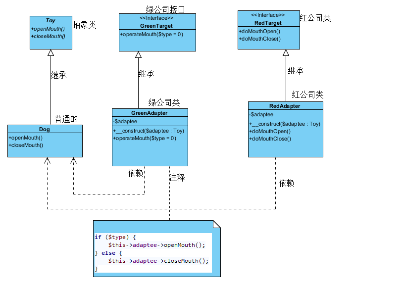

### 适配器模式概述

把对某些相似的类的操作转化为一个统一的“接口”(这里是比喻的说话)--适配器，或者比喻为一个“界面”，统一或屏蔽了那些类的细节。适配器模式还构造了一种“机制”，使“适配”的类可以很容易的增减，而不用修改与适配器交互的代码，符合“减少代码间耦合”的设计原则

[详细参考](http://www.cnblogs.com/DeanChopper/p/4770572.html)

结合代码去看

```PHP
<?php
/*
 * 适配器模式
 */
abstract class Toy
{
    public abstract function openMouth();

    public abstract function closeMouth();
}

class Dog extends Toy
{
    public function openMouth()
    {
        echo "Dog open Mouth\n";
    }

    public function closeMouth()
    {
        echo "Dog close Mouth\n";
    }
}

class Cat extends Toy
{
    public function openMouth()
    {
        echo "Cat open Mouth\n";
    }

    public function closeMouth()
    {
        echo "Cat close Mouth\n";
    }
}


//目标角色:红枣遥控公司
interface RedTarget
{
    public function doMouthOpen();

    public function doMouthClose();
}

//目标角色:绿枣遥控公司及
interface GreenTarget
{
    public function operateMouth($type = 0);
}


//类适配器角色:红枣遥控公司
class RedAdapter implements RedTarget
{
    private $adaptee;

    function __construct(Toy $adaptee)
    {
        $this->adaptee = $adaptee;
    }

    //委派调用Adaptee的sampleMethod1方法
    public function doMouthOpen()
    {
        $this->adaptee->openMouth();
    }

    public function doMouthClose()
    {
        $this->adaptee->closeMouth();
    }
}

//类适配器角色:绿枣遥控公司
class GreenAdapter implements GreenTarget
{
    private $adaptee;

    function __construct(Toy $adaptee)
    {
        $this->adaptee = $adaptee;
    }

    //委派调用Adaptee：GreenTarget的operateMouth方法
    public function operateMouth($type = 0)
    {
        if ($type) {
            $this->adaptee->openMouth();
        } else {
            $this->adaptee->closeMouth();
        }
    }
}


class testDriver //客户端，客户想要那种就实现那种
{
    public function run()
    {
        //实例化一只狗玩具
        $adaptee_dog = new Dog();
        echo "没有适配器的普通模式";
        $adaptee_dog->openMouth();
        $adaptee_dog->closeMouth();
        echo "给狗套上红枣适配器\n";
        $adapter_red = new RedAdapter($adaptee_dog);
        //张嘴
        $adapter_red->doMouthOpen();
        //闭嘴
        $adapter_red->doMouthClose();
        echo "给狗套上绿枣适配器\n";
        $adapter_green = new GreenAdapter($adaptee_dog);
        //张嘴
        $adapter_green->operateMouth(1);
        //闭嘴
        $adapter_green->operateMouth(0);
    }
}

$test = new testDriver();
$test->run();
```

### 适配器模式总结

 适配器模式将现有接口转化为客户类所期望的接口，实现了对现有类的复用，它是一种使用频率非常高的设计模式

[总结参考](http://blog.csdn.net/lovelion/article/details/8624633)
